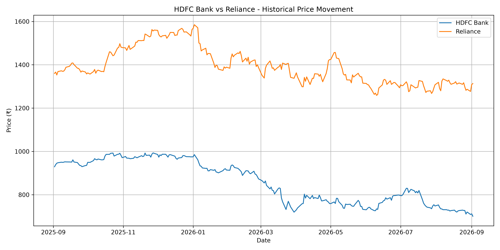
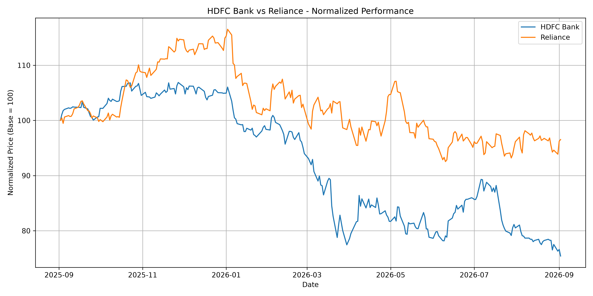
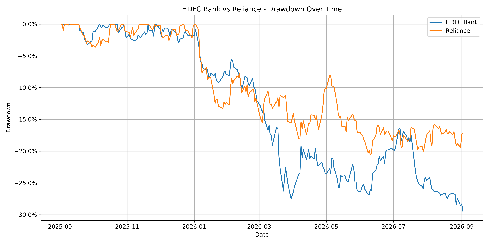
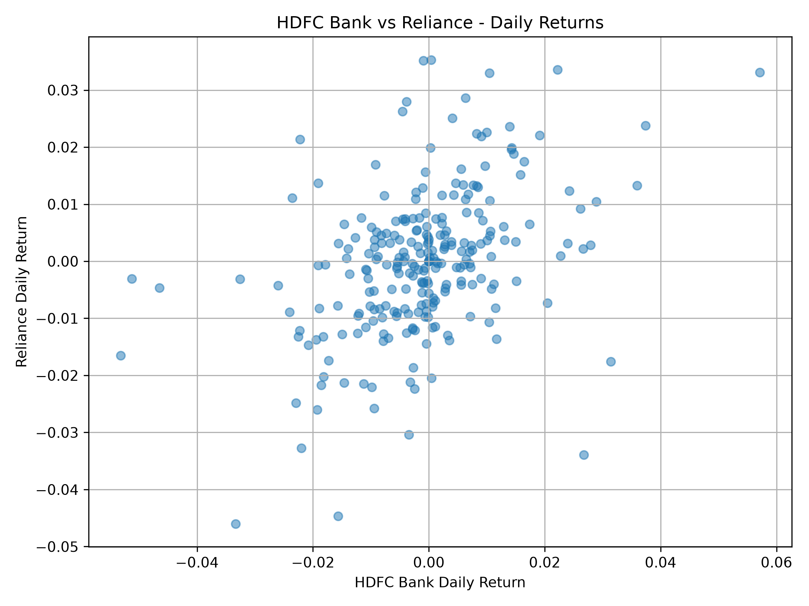
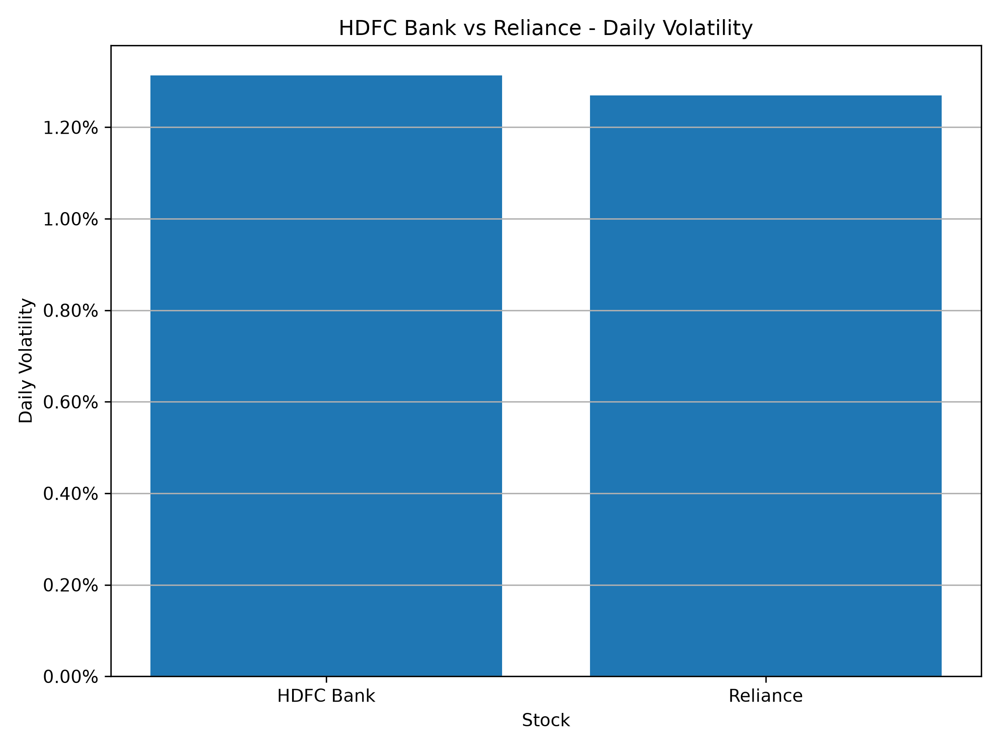

# Portfolio Risk Analysis Using Python**

## Project Overview**

This project is a personal learning project developed to apply financial risk management concepts to real-world market data using Python.

The project analyzes two publicly traded Indian companies, HDFC Bank and Reliance, and constructs a simple two-asset portfolio to understand how individual asset risk, relationships between assets, and overall portfolio risk can be measured.

The analysis covers daily returns, average return, variance, volatility, covariance, correlation, portfolio return, portfolio variance, portfolio volatility, Value at Risk (VaR), drawdown, and financial data visualization.

---

## Objective**

The objective of this project is to move beyond theoretical formulas and understand how financial risk management concepts can be applied to actual market data.

Through this project, I aimed to:

- Analyze daily stock returns

- Measure individual asset risk using variance and volatility

- Understand the relationship between two assets using covariance and correlation

- Construct a simple two-asset portfolio

- Calculate portfolio return and portfolio risk

- Estimate 1-day Value at Risk (VaR)

- Analyze historical drawdowns

- Use visualizations to interpret financial risk concepts

---

## Data & Tools**

### Market Data**

Market data is collected using Yahoo Finance through the `yfinance` Python library.

The analysis uses:

- **HDFC Bank** — `HDFCBANK.NS`

- **Reliance** — `RELIANCE.NS`

- **Data Period** — Approximately 1 year

- **Price Type** — Adjusted prices using `auto_adjust=True`

### Technologies Used**

- Python

- yfinance

- Pandas

- Matplotlib

---

## Methodology**

The project follows the following risk analysis pipeline:

### 1. Data Collection**

Historical market prices for HDFC Bank and Reliance are downloaded using `yfinance`.

### 2. Return Analysis**

Daily returns are calculated using the percentage change in prices.

The daily return is:

$$

R_t = \frac{P_t-P_{t-1}}{P_{t-1}}

$$

where:

- $P_t$ = current day's price

- $P_{t-1}$ = previous day's price

---

### 3. Average Return**

The average daily return is calculated to understand the average return generated by each stock over the selected period.

$$

\bar{R} = \frac{1}{n}\sum_{i=1}^{n}R_i

$$

---

### 4. Variance & Volatility**

Sample variance measures how widely daily returns fluctuate around their average.

$$

s^2 = \frac{\sum (R_i-\bar{R})^2}{n-1}

$$

Volatility is calculated as the square root of variance:

$$

\sigma = \sqrt{s^2}

$$

Higher volatility indicates greater variation in daily returns.

---

### 5. Covariance**

Covariance measures how the returns of two assets move together.

A positive covariance indicates that the assets tend to move in the same direction, while a negative covariance indicates that they tend to move in opposite directions.

---

### 6. Correlation**

Correlation standardizes the relationship between two assets on a scale from -1 to +1.

- `+1` → Perfect positive relationship

- `0` → No linear relationship

- `-1` → Perfect negative relationship

Correlation is useful for understanding the relationship between assets and potential diversification benefits.

---

### 7. Portfolio Construction**

A simple two-asset portfolio is constructed using:

- HDFC Bank: **60%**

- Reliance: **40%**

The portfolio weights sum to 100%.

---

### 8. Portfolio Return**

Portfolio return is calculated as the weighted average of the individual asset returns.

$$

R_p = w_A R_A + w_B R_B

$$

where:

- $w_A, w_B$ = portfolio weights

- $R_A, R_B$ = individual asset returns

---

### 9. Portfolio Variance**

For a two-asset portfolio:

$$

\sigma_p^2 =

w_A^2\sigma_A^2

+

w_B^2\sigma_B^2

+

2w_Aw_BCov(A,B)

$$

The covariance term incorporates the relationship between the two assets into the portfolio risk calculation.

---

### 10. Portfolio Volatility**

Portfolio volatility is the square root of portfolio variance:

$$

\sigma_p = \sqrt{\sigma_p^2}

$$

This provides a measure of the portfolio's daily return variability.

---

### 11. Value at Risk (VaR)**

A simplified parametric Value at Risk approach is used to estimate the potential loss threshold for the portfolio over one trading day.

$$

VaR = V \times Z \times \sigma_p

$$

where:

- $V$ = portfolio value

- $Z$ = confidence-level z-score

- $\sigma_p$ = portfolio volatility

The project calculates:

- **95% VaR** using $Z = 1.645$

- **99% VaR** using $Z = 2.326$

For a portfolio value of ₹100,000, the VaR provides an estimate of the loss threshold under the model assumptions.

---

### 12. Drawdown Analysis**

Drawdown measures the decline in an asset's price from its previous peak.

$$

Drawdown_t =

\frac{P_t-Peak_t}{Peak_t}

$$

This helps identify periods of significant historical decline and provides another perspective on downside risk.

The project calculates:

- Current drawdown

- Maximum historical drawdown

---

## Visualisations**

### Historical Price Movement**



This graph shows the historical price movement of HDFC Bank and Reliance over the selected period.

---

### Normalized Performance**



The two stocks have different nominal share prices, so their prices are normalized to a base value of 100.

This makes it easier to compare their relative performance over the same period.

---

### Drawdown Analysis**



The drawdown graph shows the percentage decline from the previous peak over time.

The lowest point represents the maximum drawdown during the period.

---

### Correlation Analysis**



Each point represents the daily return of HDFC Bank plotted against the corresponding daily return of Reliance.

The pattern helps visualize the positive relationship between their daily returns and the potential diversification benefit of combining the two assets.

---

### Volatility Comparison**



The bar chart compares the daily volatility of the two stocks.

A higher bar represents greater variability in daily returns.

---

## Key Findings**

The following results were obtained from one run of the project:

| Metric | HDFC Bank | Reliance |

|---|---:|---:|

| Average Daily Return | -0.1037% | -0.0060% |

| Daily Volatility | 1.31% | 1.27% |

| Maximum Drawdown | -29.43% | -20.58% |

### Portfolio Results**

| Metric | Result |

|---|---:|

| HDFC Bank Weight | 60% |

| Reliance Weight | 40% |

| Average Daily Portfolio Return | -0.0646% |

| Portfolio Volatility | 1.10% |

| Correlation | 0.4157 |

| 1-Day 95% VaR | ₹1,810.49 |

| 1-Day 99% VaR | ₹2,560.00 |

> **\*\*Note:\*\*** Market data is dynamic. Results may change when the project is run again because the analysis uses historical market data from Yahoo Finance.

---

## What I Learned**

This project helped me understand how financial risk management concepts connect with one another in practice.

Some of the key concepts I learned were:

- How daily returns are calculated from market prices

- The difference between variance and volatility

- How covariance measures joint movement between assets

- Why correlation is useful when evaluating diversification

- How individual asset risk contributes to portfolio risk

- How portfolio variance incorporates covariance

- How Value at Risk can be used as a risk measure

- How drawdown provides a different perspective on downside risk

- How financial data can be analyzed and visualized using Python

Most importantly, the project helped me move from learning financial risk management concepts theoretically to applying them to actual market data.

---

## Limitations**

This is a personal learning project and is not intended to represent a production-level risk management system.

Some limitations include:

- The portfolio contains only two assets

- The VaR model uses a simplified parametric approach

- The VaR calculation assumes normally distributed returns

- The analysis focuses on a 1-day horizon

- The project uses historical market data

- No stress testing or scenario analysis has been implemented

- No model validation or risk governance framework has been implemented

A production risk system would require more extensive data, validation, stress testing, controls, and model governance.

---

## How to Run

### 1. Open the project

Open the project folder in VS Code.

### 2. Install the required libraries

Open the VS Code terminal and run:

```bash
pip install -r requirements.txt
```

### 3. Run the project

```bash
python portfolio_risk_analysis_real.py
```

The program will:
1. Download market data
2. Calculate daily returns
3. Calculate individual asset risk metrics
4. Calculate covariance and correlation
5. Construct the portfolio
6. Calculate portfolio return and risk
7. Calculate 1-day VaR
8. Calculate drawdown
9. Generate visualizations
10. Display final results in the terminal

---

## Project Structure

```text
portfolio-risk-analysis/
│
├── portfolio_risk_analysis_real.py
├── portfolio_risk_analysis.py
├── README.md
├── requirements.txt
├── .gitignore
│
└── visualisations/
    ├── price_movement.png
    ├── normalized_performance.png
    ├── drawdown.png
    ├── correlation.png
    └── volatility.png
```

## Main Files

### `portfolio_risk_analysis_real.py`

The main project using real market data from Yahoo Finance.

### `portfolio_risk_analysis.py`

The earlier learning version using sample/toy data.

### `README.md`

Provides an overview of the project, methodology, results, visualizations, and instructions for running the analysis.

### `requirements.txt`

Contains the Python libraries required to run the project.

### `.gitignore`

Specifies files and folders that should not be uploaded to GitHub.

### `visualisations/`

Contains the graphs generated by the project.

## Technologies Used

- Python — Financial calculations and analysis
- yfinance — Market data collection
- Pandas — Data handling and calculations
- Matplotlib — Data visualization

## Disclaimer

This project is for educational and portfolio purposes only. It does not constitute investment advice or a recommendation to buy or sell any security.
